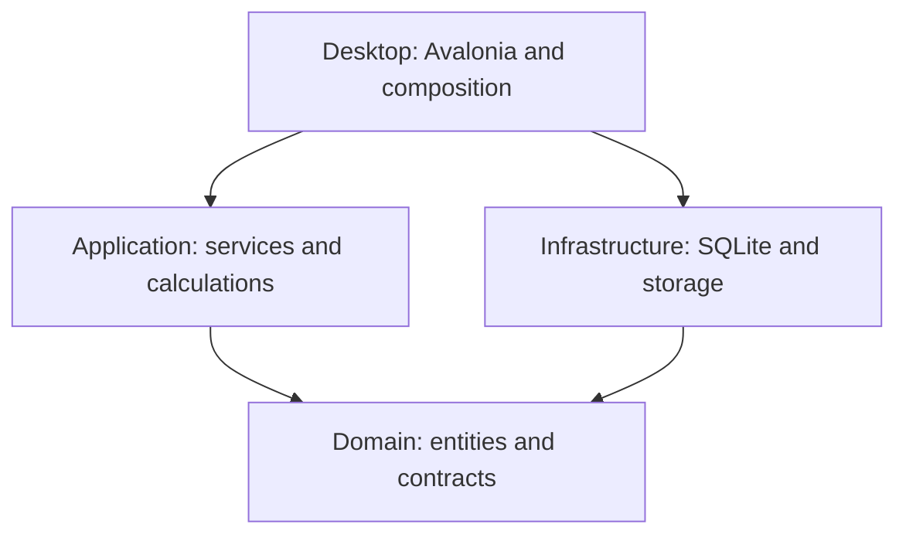
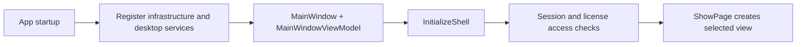

# LedgerNest developer guide

This guide describes the current C# application and where to make changes. Paths are relative to the solution directory containing `LedgerNest.CSharp.sln`. Updated September 2026.

## 1. Start here

The directory name includes `NET8`, but the active desktop project targets **.NET 10** and **Avalonia 12.1.2**. Use the project files and [global.json](../global.json) as the source of truth. The SDK configuration requests 10.0.200 with `latestFeature` roll-forward.

Read these files first:

1. [App.axaml.cs](../src/LedgerNest.Desktop/App.axaml.cs): application startup, service registration, database location, and licensing.
2. [ShellView.cs](../src/LedgerNest.Desktop/Views/ShellView.cs): navigation, page creation, appearance, and workspace access.
3. [MainWindowViewModel.cs](../src/LedgerNest.Desktop/MainWindowViewModel.cs): shared application state, routes, draft invoice fields, and calculated totals.
4. [FormCatalog.cs](../src/LedgerNest.Desktop/FormCatalog.cs) and [FormModels.cs](../src/LedgerNest.Desktop/FormModels.cs): field definitions and the models used by forms and record lists.
5. [tests/LedgerNest.UiChecks/Program.cs](../tests/LedgerNest.UiChecks/Program.cs): executable examples and regression checks.

## 2. Repository map

| Directory | Responsibility |
|---|---|
| `src/LedgerNest.Domain` | Entities, invoice snapshots, repository contracts, licensing contracts. No project dependencies. |
| `src/LedgerNest.Application` | Invoice calculation/services, licensing verification/services, amount-in-words conversion. References Domain. |
| `src/LedgerNest.Infrastructure` | EF Core SQLite context, schema maintenance, backup/restore, password credentials, license storage, dependency registration. |
| `src/LedgerNest.Desktop` | Avalonia application, shared ViewModel, views, document rendering, printing, notifications, assets. |
| `tests/LedgerNest.UiChecks` | Headless UI, calculation, persistence, report, licensing, and printing verification. |
| `tools/LedgerNest.LicenseTool` | Command-line licensing utility. |
| `tools/LedgerNest.LicenseManager` / `LedgerNest.LicensePublisher` | Publisher-side license tooling; see the licensing guide before using. |
| `invoiso-main` | Original Flutter implementation. Reference behavior here when porting features. |
| `migration` | Feature notes, compatibility decisions, known limitations, and implementation plans. |
| `docs` | Developer-facing documentation. |



The current implementation is not a fully separated MVVM application. Many screen ViewModels and report presentation models are in Desktop, and `MainWindowViewModel` directly coordinates EF Core operations. Keep new monetary calculations in Application and avoid adding persistence or business rules to control code-behind.

## 3. Build, run, and verify

Run from the solution directory:

```powershell
dotnet restore LedgerNest.CSharp.sln
dotnet build LedgerNest.CSharp.sln --no-restore
dotnet run --project src/LedgerNest.Desktop
```

For all automated checks:

```powershell
dotnet run --project tests/LedgerNest.UiChecks
```

For focused checks, pass an output directory first and a mode flag second:

```powershell
dotnet run --project tests/LedgerNest.UiChecks -- ./TestResults/appearance --appearance-only
dotnet run --project tests/LedgerNest.UiChecks -- ./TestResults/editor --invoice-editor-only
```

| Flag | Main area checked |
|---|---|
| `--appearance-only` | Language/theme changes, settings navigation, report colors, preview geometry, header ordering, currency formatting. |
| `--compact-ui-only` | Navigation, dialogs, compact controls, multiple window sizes, header height, dashboard alignment. |
| `--invoice-editor-only` | Product selection, draft editing, totals, responsive layout, saving, success screen. |
| `--invoice-settings-only` | Invoice settings UI and behavior. |
| `--product-settings-only` | Product fields/settings and product editor. |
| `--pdf-settings-only` | PDF settings. |
| `--licensing-only` | Activation and licensed-operation enforcement. |

The harness uses assertions and writes screenshots. A successful build verifies compilation, not visual correctness: inspect relevant screenshots after layout changes. Focused modes do not replace all persistence and calculation checks.

When a running application locks normal build output, use a separate output directory:

```powershell
dotnet build tests/LedgerNest.UiChecks --no-restore -p:OutputPath=bin/DeveloperCheck/
dotnet tests/LedgerNest.UiChecks/bin/DeveloperCheck/LedgerNest.UiChecks.dll ./TestResults/appearance --appearance-only
```

Do not edit or commit `bin` or `obj`. Release builds require a publisher public key; see [LICENSING.md](../migration/LICENSING.md). Do not change the target framework to work around a missing SDK.

## 4. Startup and navigation



`App.OnFrameworkInitializationCompleted` opens the desktop lifetime, creates the data directory, registers services, and constructs the window and ViewModel. On Windows, the database is normally `%LOCALAPPDATA%\LedgerNest\ledgernest.db`. License storage is under the same application data directory in `Licensing`.

`MainWindow` and `MainWindowViewModel` are **partial classes**. Their implementation spans several files. A method called from a view may be defined in a different partial file with the same namespace and class name.

`MainWindowViewModel.Routes` defines top-level navigation names. `ShellView.ShowPage` selects a view for the active route. Changing `Title` triggers page creation. Do not rebuild pages merely to change colors or translations: that can discard unsaved UI state.

## 5. Where to find a feature

| Feature | Start with |
|---|---|
| Navigation and access screens | `Views/ShellView.cs`, `MainWindow.axaml.cs`, `MainWindowViewModel.cs` |
| Dashboard | `Views/DashboardView.cs`, `DashboardPageView.axaml` and its code-behind/models |
| Customer/product/user/invoice lists | `Views/ManagementView.cs` and `.axaml` |
| Add/edit/view dialogs | `Views/RecordDialogs.cs`, `CustomerViewDialog`, `ProductViewDialog`, product form views |
| Create/edit/clone invoice | `Views/InvoiceEditorView.cs`, `InvoiceEditorShellView`, `MainWindowViewModel.Invoices.cs` |
| Invoice calculation | `LedgerNest.Application/InvoiceTotalsCalculator.cs` |
| Settings defaults and saving | `FormCatalog.cs`, `MainWindowViewModel.Settings.cs` |
| Settings navigation | `Views/SettingsView.cs`, `SettingsPageView.axaml` and `.axaml.cs` |
| Invoice preferences/custom fields | `MainWindowViewModel.InvoicePreferences.cs`, invoice settings views/sections |
| Product field visibility | `MainWindowViewModel.ProductPreferences.cs`, `ProductDetailsSettingsView.cs` |
| Database read/write and snapshots | `MainWindowViewModel.Persistence.cs`, `LedgerNestDbContext.cs` |
| Reports | `MainWindowViewModel.Reports.cs`, `Views/ReportsView.cs`, individual `*ReportView` files |
| PDF and preview | `DocumentPdf.cs`, `Views/DocumentActions.cs`, `PdfPreviewView` |
| Printing | `Printing/`, [CrossPlatformPrinting.md](CrossPlatformPrinting.md) |
| Import/export | `MainWindowViewModel.DataExchange.cs`, management actions |
| Theme/language | `App.axaml`, `UiLocalization.cs`, `Views/Ui.cs`, `Views/ShellView.cs` |
| Currency labels | `CurrencyDisplay.cs`, invoice settings, saved snapshot currency |

## 6. UI architecture and reusable controls

There are two UI styles in the repository:

- AXAML views with named hosts, bindings, styles, and templates.
- Older C# composition using `Ui.Stack`, `Ui.Columns`, `Ui.Card`, `Ui.Field`, and other helpers.

Prefer AXAML UserControls for new reusable layouts. Keep code-behind limited to presentation behavior, wiring commands, responsive arrangement, and integration with native/chart controls. Do not move database access into a new UserControl just because its old view called a ViewModel method.

Shared controls already extracted:

| Control | Purpose |
|---|---|
| `PageHeaderView` | Standard title and action band. `Ui.AppBar` delegates to it. |
| `StatisticsView` | Responsive metric cards rendered through an ItemsControl and DataTemplate. |
| `ManagementToolbarView` | Search, filter/sort/action controls, and category tabs. |
| `OverlayDialogView` | Shared modal header, scrolling body, and fixed footer. |
| `SettingsPageView` | Active page header, horizontal tabs, and settings content. |
| `InvoiceEditorShellView` | Invoice workspace with fixed header/footer hosts. |

`ManagementView` still builds table rows and some actions in C#. Extract these incrementally; preserve column visibility, row commands, selection, sorting, and pagination as each piece moves to AXAML.

### Layout rules

- Page header height is **44.8 device-independent units**. Avoid adding vertical padding around an already sized header.
- Use a Grid with `Auto,*` rows to keep a header fixed while the content scrolls.
- Settings use `Auto,Auto,*`: header, tabs, content. `SettingsPageModel.ExtractHeader` detaches the child page's `PageHeaderView` and hosts the same control above the tabs, preserving actions such as Save, Refresh, language, and theme. New settings pages should expose their header through `Ui.AppBar`/`PageHeaderView`.
- Management and dashboard content use a 12.8-unit outer gutter. The dashboard title is left-aligned and the body stretches across available width.
- PDF preview pages fit the panel width and scroll vertically through the overlay body; do not restore a page-height cap that makes text tiny.
- Keep fixed action footers outside the scrolling body.

### Binding and commands

Compiled bindings are enabled by default in the project. Some existing views explicitly opt out with `x:CompileBindings="False"`. For new typed templates, provide an appropriate `x:DataType`; do not disable compilation solely to hide a binding error.

Use existing `RelayCommand`/`AsyncRelayCommand` and CommunityToolkit observable patterns. When an action already exists on the ViewModel, wire the control to it rather than copying the implementation.

## 7. Forms, settings, and record data

`FormCatalog` defines form sections, field labels, defaults, and options. `FormField` represents editable state; `Ui.Field` renders older field definitions. `UiRecord` is the presentation record used by management lists and commonly exposes values through string keys such as `record["Total"]`.

Many labels and keys are looked up by exact strings. Renaming a visible label may break a field lookup, saved preference mapping, or test. Trace references before changing keys; localize presentation text separately.

To add a setting:

1. Add its default and field definition to the appropriate catalog section.
2. Check settings load/save and validation in `MainWindowViewModel.Settings.cs`.
3. Add its UI in the relevant settings view.
4. Apply its behavior where invoices/products are initialized or rendered.
5. Decide whether it must be captured in an invoice snapshot.
6. Verify saving, reopening, and behavior with existing documents.

Adding a toggle to a screen alone does not implement the feature.

## 8. Invoice lifecycle and historical data

The editor holds customer fields, invoice options, line ViewModels, and additional costs. `Totals` delegates to `InvoiceTotalsCalculator`. Use `decimal` throughout money calculations and retain the calculator's rounding/tax rules.

`SaveInvoice` validates the draft and coordinates persistence. `CaptureInvoiceSnapshot` stores presentation and configuration data with the invoice. A saved invoice must not silently change when a company logo, customer, product, currency, or invoice setting is later edited.

Editing loads the existing document. Cloning creates a new editable draft without payment history, then requires review and save. Document export and historical rendering should use the saved snapshot where available.

`InvoiceCreatedView` displays the saved invoice number, not the next number in the sequence. Keep both the success card and header tied to the saved record.

## 9. Currency, theme, and localization

### Currency

Use `CurrencyDisplay.Format(amount)` for current-setting presentation and `CurrencyDisplay.Format(amount, currency: savedCurrency)` for saved-document amounts. The shell configures `SelectedCurrency` to read the active ViewModel's invoice setting. `EditorCurrency` preserves historical currency while editing an invoice.

`CurrencyDisplay` is a process-wide presentation helper, not a currency conversion service. It does **not** apply exchange rates or make mixed-currency totals valid. Currency choices live in `LegacyChoices`; do not scatter `Rs.`, `INR`, or other fixed labels through views. Tests or multiple independent windows using the helper must account for its shared selected-currency provider.

### Theme

AXAML should use dynamic resources such as `AppCanvasBrush`, `AppCardBrush`, `AppTextBrush`, `AppMutedBrush`, and `AppOutlineBrush`. C# views use the corresponding `Ui` brushes or `Ui.Palette(light, dark)`. `PageHeaderBrush` comes from the application branding color.

ScottPlot renders its own background and axes, so it needs explicit theme updates through `ReportChartTheme`. A dark Avalonia parent does not automatically recolor a chart bitmap.

Test normal, hover, pressed, selected, and disabled states. Keep white foreground on a deliberately colored header; replacing it with a surface brush can make the title disappear in dark mode.

### Localization

Use `Ui.LocalText` in C# and the `UiLocalization.Text` attached property in AXAML. Catalogs are under `Assets/Localization`. Existing catalogs do not cover every desktop phrase; unsupported phrases fall back to English.

Translate captions, not database keys, user-entered values, or command parameters. For icon buttons, localize the caption child rather than binding and replacing the whole `Button.Content`.

## 10. Persistence, backups, and licensing

`LedgerNestDbContext.EnsureCurrentSchema` handles current schema compatibility work. Inspect its implementation and the legacy schema before adding columns or migrations. Do not assume that the entire Flutter database is interchangeable with the C# database.

Use isolated temporary databases in checks. Do not test restore or destructive operations against a developer's working database. Read [DATABASE_RESTORE.md](../migration/DATABASE_RESTORE.md) before changing backup/restore code.

Licensing separates signed-license verification from publisher issuance. The desktop embeds a **public** key. Private issuer keys belong outside source control and customer builds. Licensing enforcement occurs at model/service boundaries as well as UI access checks. Read [LICENSING.md](../migration/LICENSING.md) and [PASSWORD_STORAGE.md](../migration/PASSWORD_STORAGE.md) before changing authentication or license behavior.

## 11. A practical change workflow

1. Read `AGENTS.md`, inspect local changes, and locate the feature in the table above.
2. Trace the route/view, its ViewModel state, persistence, and any saved snapshot effects.
3. For migrated behavior, compare the relevant Flutter source and tests.
4. Make a focused change. Prefer a reusable AXAML control when layout is repeated.
5. Build, run relevant focused checks, and inspect generated screenshots for UI changes.
6. Run broader checks when persistence, totals, shared styles, or shared controls are affected.
7. Update feature notes when behavior or architecture changes. Record checks actually run, including failures or limitations.

Useful searches from the solution directory:

```powershell
rg -n "SaveInvoice|CaptureInvoiceSnapshot" src/LedgerNest.Desktop
rg -n "CurrencyDisplay|EditorCurrency" src/LedgerNest.Desktop
rg -n "PageHeaderBrush|Ui.AppBar" src/LedgerNest.Desktop/Views
rg --files src/LedgerNest.Desktop/Views
```

Use `-g '*.cs'` or `-g '*.axaml'` to narrow searches. Avoid modifying generated files or unrelated legacy material.

## 12. Further reading

- [Migration map](../migration/MIGRATION_MAP.md)
- [Invoice settings](../migration/INVOICE_SETTINGS.md)
- [Invoice editor layout](../migration/INVOICE_EDITOR_LAYOUT.md)
- [Product details](../migration/PRODUCT_DETAILS.md)
- [Appearance](../migration/APPEARANCE.md)
- [Compact UI](../migration/COMPACT_UI.md)
- [Production readiness plan](../migration/PRODUCTION_READINESS_PLAN.md)
- [Release matrix](../migration/RELEASE_MATRIX.md)

Migration notes can describe earlier phases. Confirm framework versions and current behavior in the project files and implementation before relying on older notes.
