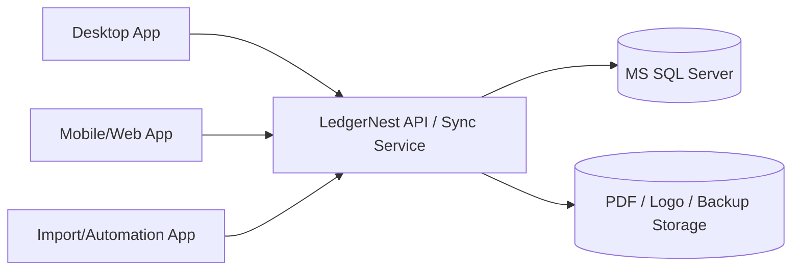

# Multi-app database plan

Status: design proposal. No implementation is complete because this document exists.

## Decision summary

Do not connect multiple running desktop apps directly to the same SQLite file on a network share. The current LedgerNest desktop app is built for a local SQLite database, and SQLite is best kept as the single-device/offline store. For multiple apps, multiple users, branch devices, mobile clients, or a shared office deployment, use a server database behind an application service. MS SQL Server is an acceptable first server database because the project already uses EF Core and the domain model can be moved provider-by-provider.

Recommended target:



The API layer is not optional for a serious multi-app deployment. It centralizes document numbering, permissions, validation, payment rules, audit logging, backups, and concurrency handling. Directly sharing one database from many thick clients would duplicate business rules in every app and make conflicts harder to control.

## Current state

The active implementation uses `LedgerNest.Infrastructure.DependencyInjection.AddInfrastructure(databasePath)` and registers `LedgerNestDbContext` with:

```csharp
options.UseSqlite($"Data Source={databasePath}")
```

The desktop startup chooses a local app-data database path named `ledgernest.db`. Schema setup currently relies on `EnsureCreated()` and in-place SQLite `ALTER TABLE` checks in `LedgerNestDbContext.EnsureCurrentSchema()`.

That means the current app supports local, single-device storage. It is not yet a multi-user database client.

## Why SQLite should remain local-only

SQLite is reliable for embedded local storage, but it is not the right shared database for multiple installed apps writing at the same time over a network folder.

Risks if multiple apps share one SQLite file:

- Network file locking can be unreliable across SMB/NAS/cloud-synced folders.
- One writer at a time limits multi-user invoice/payment workflows.
- Atomic document numbering is harder to guarantee under competing clients.
- Long reports, backup, restore, PDF generation, and imports can block writes.
- A user with file access can copy, replace, or corrupt the whole database.
- There is no central place for permission enforcement or audit policy.

SQLite can still be used for:

- Single desktop/offline mode.
- Temporary local cache.
- A future sync-first architecture where a server remains the source of truth.

## MS SQL option

MS SQL Server is a good candidate for shared deployments if the app needs:

- Multiple users on different devices.
- Concurrent invoice creation and payment receipt.
- Central backup/restore and IT administration.
- Stronger locking, transactions, recovery, and auditing.
- Reporting from a live central database.
- Integration with other business systems.

Minimum MS SQL design requirements:

- Use EF Core provider abstraction, not SQLite-specific schema code.
- Replace `EnsureCreated()` with versioned migrations.
- Store connection settings securely and support Windows/SQL authentication as a deployment choice.
- Add row version/concurrency columns for editable records.
- Allocate document numbers transactionally in the database or API service.
- Keep every invoice save, payment, stock movement, and status update inside a transaction.
- Add indexes for invoice number, customer, date, status, product, and payment lookups.
- Add deployment backup/restore runbooks before pilot use.

## Recommended architecture phases

### Phase 1 — Prepare the data layer for provider choice

Goal: make SQLite and MS SQL selectable without changing UI or business code.

Tasks:

- Introduce a database provider setting: `SQLite` or `SqlServer`.
- Change `AddInfrastructure` to accept a provider/options object instead of only `databasePath`.
- Keep SQLite as the default for local installs.
- Move SQLite-only schema upgrade logic behind provider-specific migration code.
- Add a clear startup error if an unsupported or mismatched database is opened.

Acceptance evidence:

- Existing SQLite build and UI checks still pass.
- Unit/integration checks can instantiate `LedgerNestDbContext` for SQLite and SQL Server provider options.
- No desktop view directly constructs a database connection string.

### Phase 2 — Add versioned migrations

Goal: make schema evolution safe before adding another database provider.

Tasks:

- Replace runtime `EnsureCreated()` schema patching with EF Core migrations.
- Add a schema version table/history for supported C# database versions.
- Add fixtures for old SQLite schemas and upgrade tests.
- Define SQL Server migrations separately where provider-specific SQL is needed.
- Document rollback limitations: an older app may not read an upgraded schema.

Acceptance evidence:

- Clean database creation works through migrations.
- Old supported SQLite fixtures upgrade safely.
- Unsupported Flutter/legacy schemas are rejected or imported through a dedicated importer.

### Phase 3 — Move business writes into application services

Goal: prevent every app from reimplementing save/payment rules.

Tasks:

- Move invoice save, clone, payment, stock adjustment, delete/restore, import, and numbering workflows out of desktop code-behind/view models into application services.
- Require every write path to use one service transaction.
- Keep UI as presentation only.
- Add direct service tests for conflict, retry, duplicate save, overpayment, stock behavior, and rollback.

Acceptance evidence:

- UI, import, and future API calls use the same application service methods.
- Direct service tests enforce validation without relying on disabled UI buttons.

### Phase 4 — Create a server/API app for shared deployments

Goal: make a central API the only writer to the shared MS SQL database.

Tasks:

- Add an ASP.NET Core service project, for example `LedgerNest.Server`.
- Expose endpoints for authentication, customers, products, invoices, payments, reports, settings, PDF generation, and sync health.
- Use the application services from Phase 3.
- Add role/permission enforcement at the service/API boundary.
- Add audit logging for financial writes and admin actions.
- Add API integration tests against SQL Server container/localdb/test database.

Acceptance evidence:

- Two simulated clients can create invoices/payments without duplicate numbers or lost balances.
- Permissions are enforced when calling the API directly.
- Transaction failures do not leave partial invoices, payments, or stock changes.

### Phase 5 — Update clients to use local or server mode

Goal: allow the desktop app to run either offline/local or connected/shared.

Modes:

| Mode | Storage | Best for | Notes |
| --- | --- | --- | --- |
| Local mode | SQLite on device | Single user/offline | Current default. No shared writes. |
| Server mode | API + MS SQL | Office/multi-app | Recommended for shared database. |
| Sync mode | SQLite cache + API | Offline-first multi-device | More complex; defer until server mode is stable. |

Tasks:

- Add startup configuration for local/server mode.
- In server mode, desktop calls API clients instead of direct DbContext writes.
- Decide which reports/PDFs are client-rendered versus server-rendered.
- Add connection loss behavior and clear user messaging.

Acceptance evidence:

- Local mode keeps current behavior.
- Server mode works from at least two running clients against one server database.
- Connection loss cannot silently lose a payment or invoice.

## Schema and concurrency decisions to make before coding

- Is invoice numbering global, per financial year, per branch, or per device?
- Can multiple branches use separate prefixes?
- Should quotations and invoices have separate sequences?
- Can a paid invoice be edited, voided, refunded, or only adjusted by credit note?
- What is the source of truth for product stock when multiple users sell the same item?
- Are customers/products shared globally or scoped by company/branch?
- Do users log in locally, through server accounts, or through Windows/SSO?
- What audit trail must be retained after deletion/trash?
- What data needs encryption at rest beyond database/server controls?

## Suggested implementation order

1. Keep the current SQLite app stable.
2. Add provider configuration objects and connection-string handling.
3. Add versioned migrations.
4. Extract write workflows into application services.
5. Add SQL Server provider support for tests and admin-created databases.
6. Add a server/API project that owns all shared writes.
7. Add desktop server mode.
8. Pilot with copied data and two or more concurrent clients.

## Do not do these shortcuts

- Do not put the SQLite database file in OneDrive/Dropbox/Google Drive and let many apps write to it.
- Do not open one SQLite file from multiple PCs over a shared folder as a production setup.
- Do not let desktop clients write directly to MS SQL while also keeping separate business logic in each app.
- Do not introduce SQL Server without versioned migrations and transactional document numbering.
- Do not claim multi-user readiness until concurrent invoice/payment tests pass.

## First technical spike

A safe first spike is provider selection without changing business behavior:

- Add a `DatabaseOptions` record in Infrastructure with `Provider`, `SqlitePath`, and `SqlServerConnectionString`.
- Update `AddInfrastructure` to switch between `UseSqlite` and `UseSqlServer`.
- Add the `Microsoft.EntityFrameworkCore.SqlServer` package.
- Keep the desktop startup configured for SQLite only.
- Add a small integration check that constructs the context with SQL Server options, without making the UI depend on SQL Server yet.

This spike proves the code can be prepared for MS SQL while preserving the current local app.
